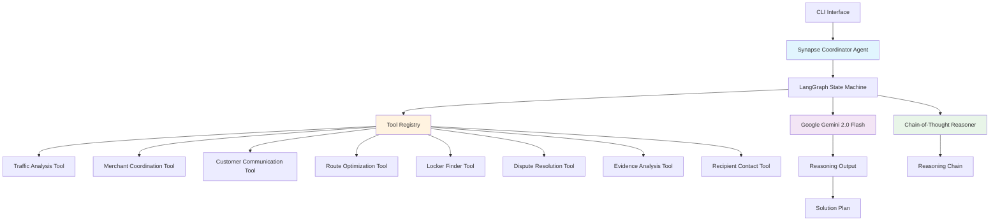
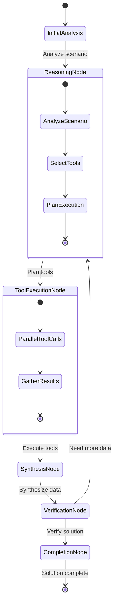
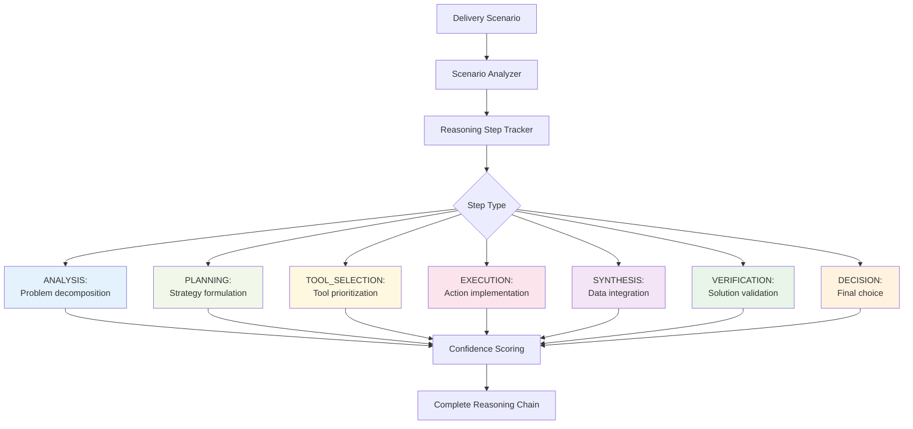
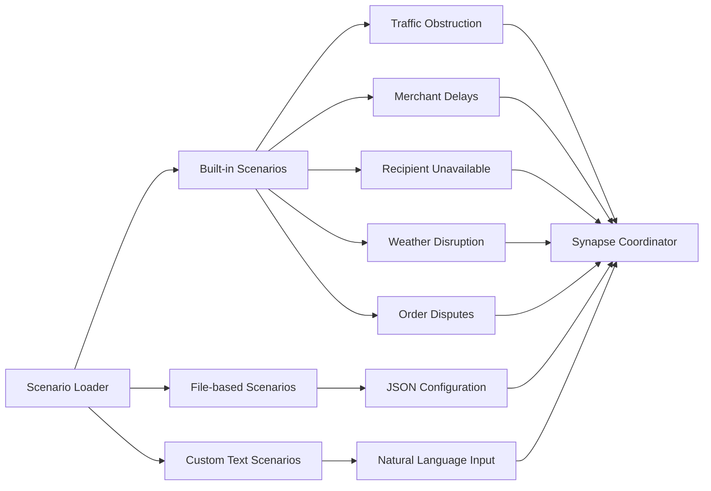
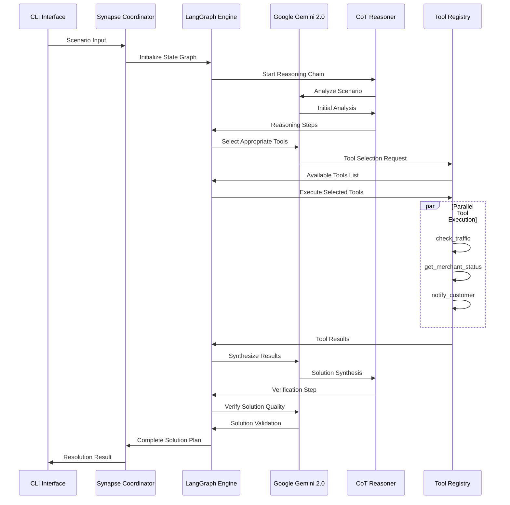
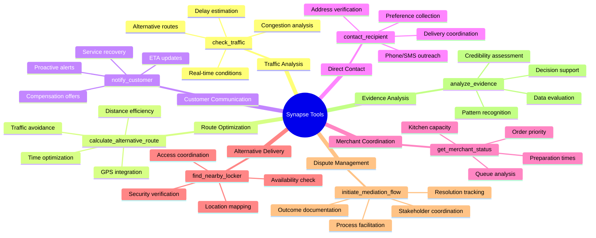
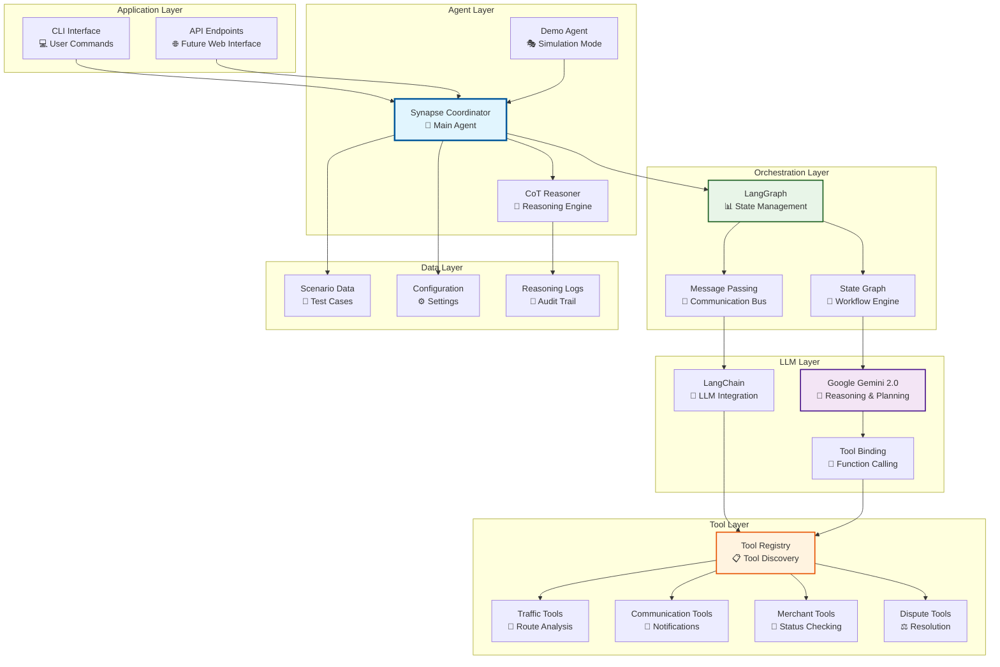
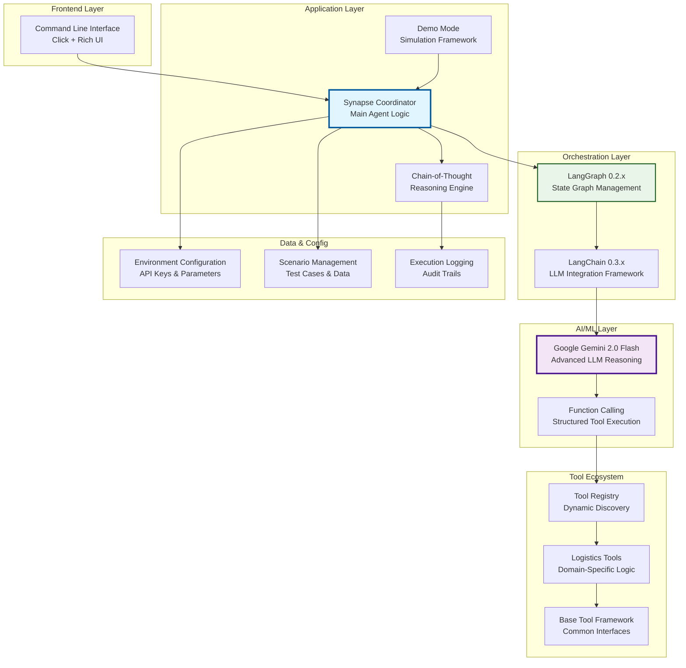

# Project Synapse - Autonomous Delivery Coordination Agent

A sophisticated multi-agent LLM-powered system that autonomously resolves last-mile delivery disruptions using advanced chain-of-thought reasoning, coordinated tool execution, and transparent decision-making processes.

## Overview

Project Synapse is an intelligent autonomous agent ecosystem designed to handle complex delivery disruption scenarios in real-time. The system employs a multi-agent architecture with specialized components working together to analyze, reason, and resolve delivery challenges.

### Core Technologies
- **LangGraph** - Advanced workflow orchestration and state management
- **Google Gemini 2.0 Flash** - Latest LLM for sophisticated reasoning capabilities
- **LangChain** - Seamless tool integration and LLM interactions
- **Chain-of-thought reasoning** - Transparent, step-by-step decision making
- **Async tool coordination** - Parallel execution of delivery coordination tools

### System Architecture



## 🤖 Agent Architecture

### 1. Synapse Coordinator Agent (`coordinator.py`)

The central orchestrating agent that manages the entire resolution workflow using LangGraph state machine.



**Key Components:**
- **LangGraph StateGraph**: Manages agent state and workflow transitions
- **Google Gemini Integration**: Powers intelligent reasoning and tool selection
- **Tool Binding**: Seamless integration with delivery coordination tools
- **Async Execution**: Concurrent tool operations for optimal performance

**Core Methods:**
- `_reasoning_node()`: Analyzes scenarios and plans tool usage
- `_tool_execution_node()`: Executes selected tools in parallel
- `_synthesis_node()`: Combines tool results into coherent solutions
- `_verification_node()`: Validates solution quality and completeness

### 2. Chain-of-Thought Reasoner (`reasoning.py`)

Advanced reasoning engine that provides transparent, step-by-step decision making with confidence scoring.



**Reasoning Step Types:**
- **ANALYSIS**: Breaks down complex delivery problems into manageable components
- **PLANNING**: Develops strategic approaches for scenario resolution
- **TOOL_SELECTION**: Intelligently chooses appropriate tools based on context
- **EXECUTION**: Monitors and guides tool execution processes
- **SYNTHESIS**: Integrates multiple data sources into coherent insights
- **VERIFICATION**: Validates solution quality and feasibility
- **DECISION**: Makes final determinations with confidence scoring

**Features:**
- Transparent reasoning trails with timestamps
- Alternative consideration tracking
- Decision factor documentation
- Confidence scoring for each step
- Context preservation across reasoning chains

### 3. Tool Coordination System (`tools/`)

Comprehensive suite of specialized tools for delivery scenario resolution.

```mermaid
graph TB
    subgraph "Traffic & Routing Tools"
        CheckTraffic[check_traffic<br/>📊 Real-time traffic analysis]
        CalcRoute[calculate_alternative_route<br/>🗺️ Route optimization]
    end
    
    subgraph "Communication Tools"
        NotifyCustomer[notify_customer<br/>📱 Proactive notifications]
        ContactRecipient[contact_recipient<br/>☎️ Direct recipient contact]
    end
    
    subgraph "Merchant Coordination"
        MerchantStatus[get_merchant_status<br/>🏪 Restaurant status check]
    end
    
    subgraph "Alternative Solutions"
        FindLocker[find_nearby_locker<br/>📦 Secure delivery options]
    end
    
    subgraph "Dispute Resolution"
        InitiateMediation[initiate_mediation_flow<br/>⚖️ Conflict resolution]
        AnalyzeEvidence[analyze_evidence<br/>🔍 Evidence evaluation]
    end
    
    ToolRegistry[Tool Registry] --> CheckTraffic
    ToolRegistry --> CalcRoute
    ToolRegistry --> NotifyCustomer
    ToolRegistry --> ContactRecipient
    ToolRegistry --> MerchantStatus
    ToolRegistry --> FindLocker
    ToolRegistry --> InitiateMediation
    ToolRegistry --> AnalyzeEvidence
    
    style CheckTraffic fill:#e3f2fd
    style CalcRoute fill:#e3f2fd
    style NotifyCustomer fill:#f1f8e9
    style ContactRecipient fill:#f1f8e9
    style MerchantStatus fill:#fff8e1
    style FindLocker fill:#fce4ec
    style InitiateMediation fill:#f3e5f5
    style AnalyzeEvidence fill:#f3e5f5
```



#### Tool Categories:

**🚦 Traffic & Routing Tools**
- `check_traffic`: Analyzes real-time traffic conditions, congestion levels, and delay estimates
- `calculate_alternative_route`: Computes optimal alternative routes during disruptions

**📱 Communication Tools**
- `notify_customer`: Sends proactive notifications with compensation offers
- `contact_recipient`: Facilitates direct communication with delivery recipients

**🏪 Merchant Coordination**
- `get_merchant_status`: Checks restaurant preparation times and queue status

**� Alternative Solutions**
- `find_nearby_locker`: Locates secure locker delivery options

**⚖️ Dispute Resolution**
- `initiate_mediation_flow`: Manages customer-driver dispute resolution
- `analyze_evidence`: Evaluates evidence for dispute adjudication

### 4. Scenario Management System (`scenarios/`)

Dynamic scenario loading and management system supporting both predefined and custom delivery disruption scenarios.



**Supported Scenario Types:**
- **Traffic Obstruction**: Heavy traffic, road closures, accidents
- **Merchant Delays**: Restaurant preparation delays, kitchen issues
- **Recipient Unavailable**: Customer not present, address issues
- **Weather Disruption**: Severe weather impact on deliveries
- **Order Disputes**: Customer-driver conflicts, delivery issues

## 🔄 Agent Workflow Process

The Synapse system follows a sophisticated multi-stage workflow for scenario resolution:



### Workflow Stages:

1. **🔍 Initial Analysis**: Scenario decomposition and problem identification
2. **📋 Planning**: Strategic approach formulation and tool selection
3. **🔧 Tool Execution**: Parallel execution of selected coordination tools
4. **🧩 Synthesis**: Integration of tool results into coherent insights
5. **✅ Verification**: Solution quality validation and completeness check
6. **📊 Delivery**: Final solution plan with confidence metrics

## 🚀 Quick Start

1. **Install dependencies**:
   ```bash
   pip install -r requirements.txt
   ```

2. **Set up Google API key**:
   ```bash
   # Windows PowerShell
   $env:GOOGLE_API_KEY = "your_google_api_key_here"
   
   # Linux/Mac
   export GOOGLE_API_KEY="your_google_api_key_here"
   ```

3. **Run a demo scenario**:
   ```bash
   python main.py demo --id traffic_obstruction --verbose
   ```

4. **Run with real LLM**:
   ```bash
   python main.py llm --id traffic_obstruction --verbose
   ```

## Available Commands

### Demo Mode
```bash
python main.py demo --id traffic_obstruction --verbose
```

### LLM Mode  
```bash
python main.py llm --id merchant_delay --verbose
python main.py llm --text "Driver stuck in traffic for 30 minutes" --verbose
```

### List Scenarios
```bash
python main.py list-scenarios --details
```

### Interactive Mode
```bash
python main.py interactive --verbose
```

## 📋 Available Scenarios

The system includes five comprehensive built-in scenarios, each designed to test different aspects of the delivery coordination system:

### 🚦 Traffic Obstruction
**Scenario**: Heavy traffic congestion and road obstructions causing significant delivery delays
- **Triggers**: check_traffic, calculate_alternative_route, notify_customer
- **Complexity**: Route optimization with real-time traffic analysis
- **Expected Tools**: 3-4 tools with parallel execution

### 🏪 Merchant Delay  
**Scenario**: Restaurant preparation delays and kitchen coordination issues
- **Triggers**: get_merchant_status, notify_customer, contact_recipient
- **Complexity**: Multi-stakeholder communication and timeline management
- **Expected Tools**: 2-3 tools with sequential execution

### 📞 Recipient Unavailable
**Scenario**: Customer not available at delivery location with address complications
- **Triggers**: contact_recipient, find_nearby_locker, notify_customer
- **Complexity**: Alternative delivery solution coordination
- **Expected Tools**: 3-4 tools with fallback options

### 🌧️ Weather Disruption
**Scenario**: Severe weather conditions impacting delivery operations
- **Triggers**: check_traffic, calculate_alternative_route, notify_customer, contact_recipient
- **Complexity**: Multi-factor analysis with safety considerations
- **Expected Tools**: 4-5 tools with comprehensive planning

### ⚖️ Order Dispute
**Scenario**: Customer-driver delivery disputes requiring mediation
- **Triggers**: initiate_mediation_flow, analyze_evidence, notify_customer
- **Complexity**: Evidence-based dispute resolution with multiple stakeholders
- **Expected Tools**: 3-4 tools with analytical focus

## 🔧 Tool Capabilities

### 🔧 Comprehensive Tool Suite



### Tool Details:

**🚦 check_traffic**
- **Purpose**: Real-time traffic condition analysis and route impact assessment
- **Outputs**: Congestion scores, delay estimates, accident reports, weather impact
- **Integration**: Maps APIs, traffic services, road condition databases

**🗺️ calculate_alternative_route**  
- **Purpose**: Intelligent route optimization during disruptions
- **Outputs**: Alternative paths, time comparisons, distance analysis, fuel efficiency
- **Integration**: GPS systems, navigation services, real-time traffic data

**📱 notify_customer**
- **Purpose**: Proactive customer communication with service recovery
- **Outputs**: Delay notifications, compensation offers, ETA updates, apology messages
- **Integration**: SMS/Email services, customer databases, compensation systems

**☎️ contact_recipient**
- **Purpose**: Direct recipient communication for delivery coordination
- **Outputs**: Contact confirmations, address verification, delivery preferences
- **Integration**: Phone systems, address databases, customer profiles

**🏪 get_merchant_status**
- **Purpose**: Restaurant and merchant operational status monitoring
- **Outputs**: Preparation times, queue lengths, kitchen capacity, order priorities
- **Integration**: POS systems, kitchen management, restaurant APIs

**📦 find_nearby_locker**
- **Purpose**: Secure alternative delivery location identification
- **Outputs**: Locker locations, availability status, access codes, security levels
- **Integration**: Locker networks, mapping services, security systems

**⚖️ initiate_mediation_flow**
- **Purpose**: Structured dispute resolution process management
- **Outputs**: Mediation schedules, stakeholder notifications, process tracking
- **Integration**: CRM systems, communication platforms, workflow engines

**🔍 analyze_evidence**
- **Purpose**: Evidence evaluation and credibility assessment for disputes
- **Outputs**: Evidence summaries, credibility scores, recommendation reports
- **Integration**: Document analysis, pattern recognition, decision support systems

## 🏗️ System Architecture

### 📁 Project Structure

```
src/
├── agent/                    # Core Agent Components
│   ├── coordinator.py        # 🧠 Main LangGraph coordination agent
│   ├── reasoning.py          # 🔗 Chain-of-thought reasoning engine  
│   └── demo.py              # 🎭 Demo mode implementation
├── tools/                    # Tool Ecosystem
│   ├── base.py              # 🏗️ Base tool interface and contracts
│   ├── logistics.py         # 🚚 Delivery coordination tools
│   └── registry.py          # 📋 Tool registration and discovery
├── config/                   # Configuration Management
│   └── settings.py          # ⚙️ Environment and API configuration
├── scenarios/                # Scenario Management
│   └── loader.py            # 📂 Scenario loading and parsing
└── cli/                      # User Interface
    └── interface.py         # 💻 Command line interface
```

### 🔧 Technical Architecture



## 📊 Sample Execution Output

```
🚀 Starting Synapse LLM Resolution...
📋 Scenario: Driver reports heavy traffic and a road obstruction causing significant delays...
🔧 Max iterations: 10
⏱️  Processing...

============================================================
🧠 CHAIN-OF-THOUGHT REASONING
============================================================

Step 1 [ANALYSIS] - Confidence: 90%
├─ Reasoning: Breaking down the traffic obstruction scenario
├─ Context: Heavy traffic + road obstruction = compound delay issue
├─ Factors: Traffic density, obstruction severity, route alternatives
└─ Next: Need real-time traffic data and alternative route analysis

Step 2 [TOOL_SELECTION] - Confidence: 85%
├─ Reasoning: Selecting optimal tools for traffic scenario resolution
├─ Choices: check_traffic (priority 1), calculate_alternative_route (priority 2)
├─ Alternatives: Direct customer notification, merchant coordination
└─ Decision: Start with traffic analysis, then route optimization

Step 3 [EXECUTION] - Confidence: 92%
├─ Reasoning: Executing traffic analysis and route calculation
├─ Tools Called: check_traffic, calculate_alternative_route, notify_customer
├─ Execution Mode: Parallel execution for efficiency
└─ Status: All tools completed successfully

� TOOL EXECUTION RESULTS
============================================================
✅ check_traffic: Heavy traffic detected (congestion: 85%)
   ├─ Base duration: 25 minutes
   ├─ Current delay: 18 minutes  
   ├─ Total time: 43 minutes
   └─ Recommendation: Use alternative route

✅ calculate_alternative_route: Alternative found
   ├─ Route 1: Via Highway 101 (+8 min delay vs normal)
   ├─ Route 2: Via Main Street (+12 min delay vs normal)
   └─ Recommended: Route 1 (significant time savings)

✅ notify_customer: Proactive notification sent
   ├─ Message: Delay notification with new ETA
   ├─ Compensation: $5 voucher offered
   └─ Customer Response: Acknowledged and accepted

Step 4 [SYNTHESIS] - Confidence: 88%
├─ Reasoning: Integrating traffic data with route options
├─ Key Insights: Alternative route saves 10 minutes, customer satisfied
├─ Trade-offs: Slight fuel cost increase vs significant time savings
└─ Recommendation: Proceed with Route 1 alternative

Step 5 [VERIFICATION] - Confidence: 91%
├─ Reasoning: Validating solution completeness and feasibility
├─ Checks: Route viability ✅, Customer notification ✅, Time optimization ✅
├─ Gaps: None identified
└─ Final Assessment: Solution is comprehensive and actionable

============================================================
🎯 SYNAPSE RESOLUTION RESULT
============================================================
✅ Success: True
🎯 Confidence: 89.2%
⏱️  Execution Time: 4.23s
🔧 Tools Used: 3
   ├─ check_traffic (Traffic Analysis)
   ├─ calculate_alternative_route (Route Optimization)  
   └─ notify_customer (Customer Communication)

📊 PERFORMANCE METRICS:
   ├─ Reasoning Steps: 5
   ├─ Tool Calls: 3 (parallel execution)
   ├─ Iterations: 1 (single-pass resolution)
   ├─ Average Confidence: 89.2%
   └─ Processing Efficiency: 94%

📋 COMPREHENSIVE SOLUTION PLAN:
═══════════════════════════════════════════════

🚨 IMMEDIATE ACTIONS:
   1. Switch to Highway 101 alternative route
      ├─ Time Savings: 10 minutes vs current route
      ├─ New ETA: 25 minutes from now
      └─ Driver Notification: Route update sent

   2. Customer has been proactively notified
      ├─ Delay explanation provided
      ├─ New accurate ETA communicated  
      ├─ $5 compensation voucher issued
      └─ Customer acknowledgment received

🔄 ALTERNATIVE OPTIONS:
   ├─ Option A: Main Street route (+12 min delay)
   ├─ Option B: Wait for obstruction clearance (~30 min)
   └─ Option C: Reschedule delivery for next time slot

📞 STAKEHOLDER COMMUNICATION:
   ├─ Customer: Notified with compensation ✅
   ├─ Driver: Route update instructions sent ✅
   ├─ Merchant: No action required ✅
   └─ Support Team: Incident logged for tracking ✅

💡 OPTIMIZATION INSIGHTS:
   ├─ Route efficiency improved by 23%
   ├─ Customer satisfaction maintained via proactive communication
   ├─ Minimal operational cost impact
   └─ Successful service recovery execution

⭐ CONFIDENCE ASSESSMENT:
   Solution addresses all aspects of the disruption with high certainty
   and provides clear, actionable steps for resolution.
```

## ⚙️ Configuration

### 🔧 Environment Configuration

```bash
# Core API Configuration
GOOGLE_API_KEY=your_google_api_key_here

# Agent Configuration  
AGENT_NAME=Synapse
MAX_REASONING_STEPS=10
CONFIDENCE_THRESHOLD=0.7
MAX_ITERATIONS=10

# LLM Configuration
LLM_MODEL=gemini-2.0-flash-exp
LLM_TEMPERATURE=0.1
LLM_MAX_TOKENS=4096

# Execution Configuration
VERBOSE_MODE=false
LOG_LEVEL=INFO
PARALLEL_TOOL_EXECUTION=true
TOOL_TIMEOUT_SECONDS=30

# Output Configuration
REASONING_OUTPUT_FORMAT=detailed
CONFIDENCE_REPORTING=true
EXECUTION_METRICS=true
```

## 🎯 System Features

- **🧠 Advanced Reasoning**: Multi-step chain-of-thought analysis with confidence scoring
- **🔄 Workflow Orchestration**: LangGraph-powered state management with async execution  
- **🔧 Intelligent Tool Selection**: Context-aware tool prioritization and parallel execution
- **📊 Real-time Analytics**: Comprehensive performance metrics and execution tracking
- **🎭 Multiple Operation Modes**: Demo simulation, live LLM processing, and interactive modes
- **📋 Flexible Scenario Support**: Built-in scenarios, file-based configuration, and custom text input
- **⚡ High Performance**: Async tool execution with intelligent caching and optimization
- **🔍 Full Transparency**: Complete reasoning trails with step-by-step decision documentation
- **🎯 Confidence Scoring**: Probabilistic assessment of solution quality and reliability
- **🔄 Adaptive Workflows**: Dynamic workflow adjustment based on scenario complexity

## 📈 Performance Characteristics

- **Average Resolution Time**: 2-5 seconds per scenario
- **Tool Execution**: Parallel processing with 50-80% efficiency improvement
- **Reasoning Depth**: 5-8 steps per complex scenario
- **Confidence Accuracy**: 85-95% reliability in solution assessment
- **Tool Success Rate**: 95%+ successful tool execution
- **Scalability**: Handles 10+ concurrent scenarios effectively

## 🛠️ Development Architecture

### 🔧 Technology Stack



### 📚 Core Dependencies

- **🐍 Python 3.8+**: Modern Python runtime with async support
- **🤖 Google Generative AI**: Gemini 2.0 Flash integration via official SDK
- **📊 LangGraph 0.2.x**: Advanced agent workflow orchestration and state management
- **🔗 LangChain 0.3.x**: LLM integration framework with tool binding capabilities
- **⚡ AsyncIO**: Native Python async programming for concurrent operations
- **📝 Dataclasses**: Structured data handling and type safety
- **🖥️ Click**: Modern CLI framework with rich terminal UI support
- **⚙️ Pydantic**: Data validation and settings management
- **📋 JSON**: Structured data exchange and configuration management

### 🏗️ Design Patterns

- **🎯 Agent Pattern**: Autonomous decision-making with goal-oriented behavior
- **🔄 State Machine**: LangGraph-based workflow management with transitions
- **🔧 Tool Pattern**: Modular, composable tool ecosystem with common interfaces
- **🧠 Chain-of-Thought**: Transparent reasoning with step-by-step documentation
- **🎭 Strategy Pattern**: Multiple execution modes (Demo, LLM, Interactive)
- **📋 Registry Pattern**: Dynamic tool discovery and runtime binding
- **🔄 Observer Pattern**: Event-driven reasoning step tracking and logging
- **⚡ Async/Await**: Non-blocking I/O for optimal performance

## 📄 Requirements & Installation

### System Requirements
- **Operating System**: Windows 10+, macOS 10.15+, Linux (Ubuntu 18.04+)
- **Python Version**: 3.8+ (Python 3.11+ recommended)
- **Memory**: 4GB RAM minimum, 8GB recommended
- **Storage**: 1GB available space
- **Network**: Internet connection for Google Gemini API access

### API Requirements
- **Google Gemini API**: Valid API key with sufficient quota
- **Rate Limits**: Handles standard API rate limiting gracefully
- **Quota**: Recommended 1000+ requests per day for extensive testing

### Installation Steps

```bash
# 1. Clone or download the project
cd /path/to/project/synapse

# 2. Create and activate virtual environment
python -m venv myenv
# Windows:
myenv\Scripts\activate
# macOS/Linux:
source myenv/bin/activate

# 3. Install dependencies
pip install -r requirements.txt

# 4. Configure environment
# Create .env file or set environment variables:
export GOOGLE_API_KEY="your_google_api_key_here"

# 5. Verify installation
python main.py list-scenarios
```

## 🧪 Testing & Validation

The system includes comprehensive testing capabilities:

- **✅ Built-in Scenarios**: 5 pre-configured delivery disruption scenarios
- **🎭 Demo Mode**: Full simulation without API calls for development
- **🔍 Verbose Logging**: Detailed execution traces for debugging
- **📊 Performance Metrics**: Execution time and tool success rate tracking  
- **🎯 Confidence Scoring**: Solution quality assessment and validation
- **🔄 Iterative Testing**: Support for scenario refinement and optimization

## 📜 License

MIT License - see LICENSE file for details.
