# Project Synapse - Autonomous Delivery Coordination Agent

A sophisticated LLM-powered agent that resolves last-mile delivery disruptions using chain-of-thought reasoning and coordinated tool execution.

## Overview

Project Synapse is an autonomous agent designed to handle delivery disruption scenarios in real-time. It uses:

- **LangGraph** for workflow orchestration
- **Google Gemini** for LLM-powered reasoning  
- **LangChain** for tool integration
- **Chain-of-thought reasoning** for transparent decision making
- **Coordinated tool execution** for data gathering and action taking

## Features

- 🧠 **Intelligent Reasoning**: Chain-of-thought analysis of delivery scenarios
- 🔧 **Tool Coordination**: Automated traffic checking, merchant coordination, customer communication
- 📊 **Real-time Analytics**: Performance metrics and confidence scoring
- 🎯 **Multiple Modes**: Demo mode, LLM mode, and interactive mode
- 📋 **Scenario Management**: Predefined and custom delivery disruption scenarios

## Quick Start

1. **Install dependencies**:
   ```bash
   pip install -r requirements.txt
   ```

2. **Set up Google API key**:
   ```bash
   # Windows PowerShell
   $env:GOOGLE_API_KEY = "your_google_api_key_here"
   
   # Linux/Mac
   export GOOGLE_API_KEY="your_google_api_key_here"
   ```

3. **Run a demo scenario**:
   ```bash
   python main.py demo --id traffic_obstruction --verbose
   ```

4. **Run with real LLM**:
   ```bash
   python main.py llm --id traffic_obstruction --verbose
   ```

## Available Commands

### Demo Mode
```bash
python main.py demo --id traffic_obstruction --verbose
```

### LLM Mode  
```bash
python main.py llm --id merchant_delay --verbose
python main.py llm --text "Driver stuck in traffic for 30 minutes" --verbose
```

### List Scenarios
```bash
python main.py list-scenarios --details
```

### Interactive Mode
```bash
python main.py interactive --verbose
```

## Available Scenarios

- **traffic_obstruction**: Heavy traffic and road obstruction delays
- **merchant_delay**: Restaurant preparation delays  
- **recipient_unavailable**: Delivery recipient not available
- **weather_disruption**: Severe weather impact on deliveries
- **order_dispute**: Customer-driver delivery disputes

## Tool Capabilities

The agent has access to these tools:

- **check_traffic**: Real-time traffic condition analysis
- **get_merchant_status**: Restaurant preparation time checking
- **notify_customer**: Proactive customer communication with compensation
- **calculate_alternative_route**: Route optimization during disruptions
- **contact_recipient**: Direct recipient communication
- **find_nearby_locker**: Secure delivery alternatives
- **initiate_mediation_flow**: Dispute resolution coordination
- **analyze_evidence**: Evidence analysis for dispute resolution

## Architecture

### System Overview


### Component Architecture


### LangGraph Workflow Detail


### Tool Execution Flow

```mermaid
sequenceDiagram
    participant LLM as Gemini LLM
    participant LC as LangChain StructuredTool
    participant TR as Tool Registry
    participant LT as Logistics Tool
    participant RE as Reasoning Engine
    
    LLM->>LC: Tool call decision
    LC->>TR: Get tool instance
    TR->>LT: Execute with parameters
    LT->>LT: Async execution
    LT->>LC: Return ToolResult
    LC->>RE: Update reasoning steps
    RE->>LLM: Tool output for synthesis
    
    Note over LLM,RE: Available Tools:
    Note over LLM,RE: • check_traffic
    Note over LLM,RE: • get_merchant_status  
    Note over LLM,RE: • notify_customer
    Note over LLM,RE: • calculate_alternative_route
    Note over LLM,RE: • contact_recipient
    Note over LLM,RE: • find_nearby_locker
    Note over LLM,RE: • initiate_mediation_flow
    Note over LLM,RE: • analyze_evidence
```


### Data Flow Architecture
```mermaid
graph TD
    IS[Input Scenario] --> AS[AgentState]
    
    subgraph AS [AgentState Structure]
        MSG[messages: List[BaseMessage]]
        SC[scenario: str]
        RS[reasoning_steps: List[Dict]]
        TCM[tool_calls_made: List[Dict]]
        GD[gathered_data: List[Dict]]
        SP[solution_plan: Optional[Dict]]
        CI[current_iteration: int]
        CS_SCORE[confidence_score: float]
    end
    
    AS --> TR[Tool Results]
    
    subgraph TR [Tool Results Structure]
        SUCCESS[success: bool]
        DATA[data: Dict[str, Any]]
        MESSAGE[message: str]
        TIMESTAMP[timestamp: datetime]
        CONF[confidence_score: float]
    end
    
    TR --> RR[Resolution Result]
    
    subgraph RR [Resolution Result Structure]
        R_SUCCESS[success: bool]
        R_STEPS[reasoning_steps: List[str]]
        R_TOOLS[tools_used: List[str]]
        R_PLAN[solution_plan: Dict]
        R_CONF[confidence_score: float]
        R_TIME[execution_time: float]
    end
    
    style AS fill:#e8f5e8
    style TR fill:#fff3e0
    style RR fill:#e1f5fe
```

### Tool Registry Pattern


## File Structure

```
src/
├── agent/
│   ├── coordinator.py    # Main LangGraph agent coordinator
│   ├── reasoning.py      # Chain-of-thought reasoning engine
│   └── demo.py          # Demo mode implementation
├── tools/
│   ├── base.py          # Base tool interface
│   ├── logistics.py     # Delivery coordination tools
│   └── registry.py      # Tool registration and discovery
├── config/
│   └── settings.py      # Configuration management
├── scenarios/
│   └── loader.py        # Scenario loading and management
└── cli/
    └── interface.py     # Command line interface
```
